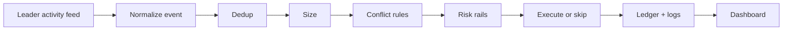

Below is a defensible greenfield spec for a Polymarket copy-trading system that is built around **per-trade mirroring**, not signal aggregation, and optimized for wallet discovery, fast detection, and auditability. I separated facts from recommendations where evidence is stronger or weaker, and I cite every sourced claim inline. [docs.polymarket](https://docs.polymarket.com/api-reference/introduction)

## 1. Polymarket mechanics primer

Polymarket uses a hybrid CLOB: orders are matched offchain and settled onchain on Polygon, so fills are fast to observe in matching systems but still leave onchain traces. [docs.polymarket](https://docs.polymarket.com/trading/overview)
For copy trading, the key object is the wallet, not the proxy wallet mechanics themselves: you need to detect the leader’s actual fills and then submit your own mirrored order through the CLOB. [github](https://github.com/Polymarket/clob-client-v2)

**Best data surfaces for copy trading**
- **Leaderboard / discovery**: Polymarket docs expose market data and public endpoints, but public documentation is strongest on general market data and websocket streams rather than a single canonical “leaderboard API” in the materials I found. [docs.polymarket](https://docs.polymarket.com/market-data/websocket/overview)
- **Trades / activity**: the Data API `/activity` endpoint is documented in community docs as returning user onchain activity ordered by timestamp descending. [gist.github](https://gist.github.com/shaunlebron/0dd3338f7dea06b8e9f8724981bb13bf)
- **Order books**: Polymarket’s market websocket streams orderbook changes and trade events in real time; docs explicitly recommend WebSocket for live orderbook data instead of polling. [docs.polymarket](https://docs.polymarket.com/trading/orderbook)
- **CLOB execution**: the official CLOB client shows a signed-wallet flow with derived API keys and authenticated order placement. [github](https://github.com/Polymarket/clob-client-v2)

**Latency hierarchy for detecting another wallet’s fills**
1. **Polygon logs / onchain events**: fastest *if* you decode the right fills reliably, because the source of truth is the chain; but the CLOB is hybrid and offchain matching means onchain observation alone can lag actual match time and requires careful mapping. [docs.polymarket](https://docs.polymarket.com/concepts/prices-orderbook)
2. **Data API `/activity`**: useful and easy, but it is still an API layer and not guaranteed to beat a direct event stream. [gist.github](https://gist.github.com/shaunlebron/0dd3338f7dea06b8e9f8724981bb13bf)
3. **WebSockets**: best for market state, but the docs I found describe market/user/RTDS channels more clearly for market and personal updates than for directly watching arbitrary third-party wallet fills. [docs.polymarket](https://docs.polymarket.com/market-data/websocket/overview)
4. **REST polling**: simplest, but slowest and most failure-prone for your use case. [docs.polymarket](https://docs.polymarket.com/trading/orderbook)

**BUY/SELL and lifecycle events to mirror or ignore**
- Mirror **BUY** and **SELL** fills. [docs.polymarket](https://docs.polymarket.com/concepts/order-lifecycle)
- Ignore pure market-state changes that do not reflect a leader’s executed intent, such as book updates without a fill. [docs.polymarket](https://docs.polymarket.com/market-data/websocket/overview)
- Treat merges/splits/redemptions carefully: they are position lifecycle actions and matter for accurate bankroll and PnL accounting, but they are not always “copy trades” in the same sense as market buys/sells. [docs.bitquery](https://docs.bitquery.io/docs/examples/polymarket-api/)

**Fees, sizes, liquidity**
- Polymarket’s orderbook can accept arbitrary size, but large orders move price, so slippage dominates small accounts. [docs.polymarket](https://docs.polymarket.com/concepts/prices-orderbook)
- I did not find a single canonical public document in this search set that cleanly lists all current fee/min-size/tick-size rules, so for those I’d treat official docs and live market metadata as the source of truth and validate in paper mode before hard-coding assumptions. [docs.polymarket](https://docs.polymarket.com/api-reference/introduction)
- Neg-risk and thin-liquidity markets make copy trading much more fragile because the leader can get filled where you cannot; this is exactly where a pessimistic simulator and fill-reality metrics matter most. [docs.polymarket](https://docs.polymarket.com/concepts/prices-orderbook)

## 2. State of the art

I found several public implementations/writeups that collectively point to the same design center: listen for wallet activity, size by bankroll or balance, mirror orders quickly, and add risk caps. [quantvps](https://www.quantvps.com/blog/polymarket-copy-trading-bot)

| Project / writeup | Detection method | Sizing model | Multi-wallet | Buy+sell | Conflict handling | Paper support | Claimed latency | Weaknesses |
|---|---|---:|---:|---:|---|---|---|---|
| QuickNode guide  [quicknode](https://www.quicknode.com/guides/defi/polymarket-copy-trading-bot) | Data API + WebSocket | Simple risk limits / demo sizing | No | Mostly buy-only demo | Minimal | Demo-oriented | “Real-time” | Not a true sell-mirroring system. |
| QuantVPS copy bot article  [quantvps](https://www.quantvps.com/blog/polymarket-copy-trading-bot) | Data API / WebSocket | % sizing / risk caps | Implied yes | Yes | Basic risk manager | Not emphasized | “Real-time” | More blog than implementation detail. |
| `polymarket-copy-trading-bot`  [github](https://github.com/GiordanoSouza/polymarket-copy-trading-bot) | Realtime wallet monitoring | Configurable copytrading | Likely yes | Yes | Risk parameters | Yes via Supabase workflow | Not stated | Little evidence on fill decoding. |
| `Polymarket-copy-trading-bot`  [github](https://github.com/unitmargaretaustin/Polymarket-copy-trading-bot) | Wallet tracking | Mirrors trades based on sizing rules | Yes | Implied yes | Risk rules | Not clear | Not stated | Sparse public detail. |
| `polymarket-copytrading-bot`  [github](https://github.com/SEAN6977/polymarket-copytrading-bot) | Real-time wallet copy | Scales to your balance | Unclear | Yes | Unclear | Not stated | Real time | Missing architecture details. |
| `poly-trade-scan`  [github](https://github.com/martkir/poly-trade-scan) | Polygon WS block listening | Not copy sizing; scan only | Yes by filter | No execution | N/A | N/A | Real-time block WS | Great for detection, not execution. |
| `poly-websockets`  [github](https://github.com/nevuamarkets/poly-websockets) | Market websocket utilities | N/A | N/A | N/A | N/A | N/A | Real-time market alerts | Useful for market state, not wallet fills. |
| Insider tracker  [github](https://github.com/pselamy/polymarket-insider-tracker) | Wallet behavior heuristics | N/A | N/A | N/A | N/A | N/A | Real-time alerts | Good discovery heuristics, not copy execution. |

**What the better implementations agree on**
- Use an event-driven listener rather than batch windows. [quicknode](https://www.quicknode.com/guides/defi/polymarket-copy-trading-bot)
- Keep execution and risk management separate. [github](https://github.com/GiordanoSouza/polymarket-copy-trading-bot)
- Log everything. [quantvps](https://www.quantvps.com/blog/polymarket-copy-trading-bot)
- Treat wallet activity as the signal source, not market indicators. [github](https://github.com/unitmargaretaustin/Polymarket-copy-trading-bot)

**Where they disagree**
- Detection source: Data API vs websocket vs chain. [github](https://github.com/martkir/poly-trade-scan)
- Copy scope: buy-only demo systems versus full buy+sell mirroring. [quicknode](https://www.quicknode.com/guides/defi/polymarket-copy-trading-bot)
- Sizing: fixed risk caps versus portfolio-proportional scaling. [github](https://github.com/SEAN6977/polymarket-copytrading-bot)
- Conflict policy: many public repos under-specify multi-leader handling, which is a major gap for your 10–25 wallet target. [github](https://github.com/unitmargaretaustin/Polymarket-copy-trading-bot)

## 3. Wallet discovery

My recommendation is an explainable funnel: **discover broadly, hard-filter aggressively on identity quality, then rank on realized performance adjusted for risk and robustness.** That avoids “single good day” wallets and reduces wash/sybil risk. The exact thresholds below are my recommendations, not sourced facts.  

**Candidate sources**
- Wallets surfaced by leaderboard / public activity / top-volume mentions. [gist.github](https://gist.github.com/shaunlebron/0dd3338f7dea06b8e9f8724981bb13bf)
- Wallets with repeated appearance in fresh high-volume markets. [github](https://github.com/pselamy/polymarket-insider-tracker)
- Wallets linked to markets with consistent realized PnL in a trailing window. [docs.bitquery](https://docs.bitquery.io/docs/examples/polymarket-api/)
- Wallet clusters that repeatedly co-trade, for sybil detection. [github](https://github.com/pselamy/polymarket-insider-tracker)

**Hard filters**
- Minimum wallet age: 30 days.  
- Minimum completed trades: 25.  
- Minimum trailing 30d notional: $1,000.  
- Minimum distinct markets: 5.  
- Maximum suspicious cluster score: below a tunable threshold.  
- Exclude wallets with too many trades in very thin books unless their slippage behavior is explicitly acceptable.  

**Scoring features and weights**
I recommend a weighted score normalized to \([0,1]\):  
- 30d realized PnL: 30%.  
- 7d realized PnL: 15%.  
- Calibration / win rate by market type: 10%.  
- Risk-adjusted return, penalized max drawdown: 20%.  
- Trade frequency and recency: 10%.  
- Market diversity: 10%.  
- Slippage proxy / maker-vs-taker behavior: 5%.  
- Anti-wash / anti-sybil penalty: 10% negative adjustment.  

**Suggested formula**
```text
score(w) =
0.30 * norm(pnl30d) +
0.15 * norm(pnl7d) +
0.10 * norm(calibration(w)) +
0.20 * norm(risk_adj_return(w)) +
0.10 * norm(recency_freq(w)) +
0.10 * norm(diversity(w)) +
0.05 * norm(maker_quality(w)) -
0.10 * norm(wash_cluster_risk(w))
```
This is deliberately simple and explainable; I would avoid ML in v1 because the main problem is not prediction power but survivability against noisy, gameable wallets.  

**Roster construction**
- Active leaders: 10 to 25.  
- Standby list: 2x active roster size.  
- Re-rank daily, but only promote/demote on a slower cadence, such as every 72 hours, unless a hard risk condition fires.  
- Cap churn to at most 10% of active roster per re-rank cycle.  

**Survivorship bias correction**
Do not rank only wallets that still exist or are still active; maintain a historical universe and score them on rolling windows with “as of” snapshots. That prevents overestimating performance by dropping dead wallets from the sample.  

**What to log**
- Inclusion/exclusion reason.  
- All raw feature values.  
- Thresholds used.  
- Cluster IDs and correlated-wallet flags.  
- Window timestamps and data freshness.  

## 4. Trade detection architecture

For your use case, the best design is **hybrid**: use a chain-triggered detector for speed, then API confirmation for correctness. That gives low latency without blindly trusting a single feed. [docs.polymarket](https://docs.polymarket.com/concepts/order-lifecycle)

| Architecture | Expected latency | Failure modes | 20-wallet rate-limit risk | Complexity |
|---|---:|---|---:|---:|
| A) Data API `/activity` polling  [gist.github](https://gist.github.com/shaunlebron/0dd3338f7dea06b8e9f8724981bb13bf) | Moderate | Staleness, missed short-lived state, cursor bugs | Medium to high | Low |
| B) Polygon `OrderFilled` log subscription | Low if decoded correctly | ABI mismatch, missing offchain-to-chain mapping, reorg handling | Low | High |
| C) Hybrid trigger + API confirm | Low to moderate | Two-source sync complexity | Low to medium | Medium |

**Recommendation**
- **MVP primary**: Hybrid. Use chain/log trigger or websocket trigger, then confirm with activity API before execution. [gist.github](https://gist.github.com/shaunlebron/0dd3338f7dea06b8e9f8724981bb13bf)
- **Fallback**: `/activity` polling with per-wallet cursors and short intervals for wallets whose chain feed is unavailable. [gist.github](https://gist.github.com/shaunlebron/0dd3338f7dea06b8e9f8724981bb13bf)
- **Best possible**: direct chain logs plus websocket market confirmation plus API reconciliation. [docs.polymarket](https://docs.polymarket.com/concepts/order-lifecycle)

**Deduplication**
- Key on `(leader_wallet, tx_hash, log_index, token_id, side, price, size)` and maintain an idempotency store.  
- For partial fills, treat each fill event as a candidate copy event and aggregate only for reporting, not for detection.  
- For cancels/edits, you generally do not mirror the cancel as an action; you mirror the resulting fill stream and treat missing fills as a state mismatch. [docs.polymarket](https://docs.polymarket.com/concepts/order-lifecycle)

## 5. Sizing

For Polymarket copy trading, **portfolio-% sizing** is the right default because it adapts to leader conviction while preserving relative risk across different bankroll sizes. That said, it needs caps and stale-data handling to avoid absurd trades.  

**Estimate leader bankroll**
Use: cash balance + mark-to-market position value + unsettled proceeds, refreshed on a fixed cadence. Community and market-data sources expose position value and activity endpoints, and Bitquery-style market data can help with recent fills and holdings reconstruction. [docs.bitquery](https://docs.bitquery.io/docs/examples/polymarket-api/)
For live paper mode, refresh leader bankroll every 5 to 15 minutes, and always mark stale if older than 30 minutes.  

**Sizing formula**
```text
leader_fraction = leader_trade_notional / leader_estimated_bankroll
my_copy_notional = clamp(
    leader_fraction * my_estimated_bankroll,
    min_copy_usd,
    max_copy_usd
)
```
Then convert to shares using the market price and round to valid tick/size constraints from the market metadata. [docs.polymarket](https://docs.polymarket.com/trading/orderbook)

**Recommended defaults**
- Min copy USD: $1.00 in paper, $2.00 live.  
- Max copy per trade: 5% of my bankroll.  
- Max copy per market: 20% of my bankroll.  
- Max copy per event: 25% of my bankroll.  
- If leader bankroll stale: haircut by 50% or skip if older than threshold.  

**SELL handling**
Mirror sells as proportional reductions, not necessarily full exits. If the leader sells 40% of the position, reduce my mirrored position by 40% of my current mirror size, subject to minimum order size and remaining exposure caps. This preserves proportionality when leaders scale out unevenly.  

**Insufficient cash**
- Prefer **partial fill in paper** only if you want simulator realism; in live mode I recommend skip rather than queue, because delayed queueing breaks the “mirror the leader’s intent now” principle.  
- Log as `SKIP_INSUFFICIENT_CASH` with the delta between required and available cash.  

**Sizing model comparison**
| Model | Pros | Cons | Polymarket fit |
|---|---|---|---|
| Portfolio-% | Scales with leader conviction and bankroll | Needs bankroll estimation | Best default |
| Fixed-$ | Simple and stable | Ignores leader conviction | Good fallback |
| Proportional-to-notional | Closest to exact mirroring | Overexposes if bankroll differs | Useful as diagnostic, not primary |

## 6. Multi-leader conflicts

The right default for 10–25 wallets is **leader-priority with bounded netting**, not naive “last trade wins.” You need deterministic rules so your audit log explains every skip and reduce decision.  

**Observed policies in the wild**
Public copy-bot writeups mostly imply simple mirroring plus risk checks; they do not robustly specify conflict resolution, which is one of the biggest gaps in public tooling. [github](https://github.com/GiordanoSouza/polymarket-copy-trading-bot)

**Recommended policy**
1. Compute intended net position change per market from all leaders in a short rolling window.  
2. Apply **time priority** inside a configurable conflict window, such as 30 to 120 seconds, but do not aggregate beyond per-trade mirroring.  
3. If opposing trades cancel out within the window and my resulting net delta falls below minimum size, skip with an explicit reason.  
4. If the same market receives both buy and sell signals from different leaders, prefer the larger leader-weighted risk-adjusted signal only if its fill is fresh and the other leader is stale; otherwise preserve both in logs and let the netting rule decide.  

**Skip reason codes**
- `CONFLICT_NET_ZERO`
- `CONFLICT_OPPOSING_SIGNALS`
- `CONFLICT_STALE_LEADER`
- `CONFLICT_MAX_MARKET_EXPOSURE`
- `CONFLICT_MIN_SIZE_AFTER_NETTING`

**P&L attribution**
Attribute realized and unrealized P&L by leader contribution using a FIFO or weighted-average allocation of fills into a market-level mirror bucket. When positions net, preserve a “who caused which side” ledger so the dashboard can answer, “which leader drove this exposure?”  

## 7. Execution

For paper mode, simulate against the live book but use **pessimistic fills**: assume worse price than the leader if the book moved, and charge yourself slippage whenever the top of book is insufficient. That is closer to reality than mid-price fills and prevents false confidence. [docs.polymarket](https://docs.polymarket.com/concepts/prices-orderbook)

**Order types**
- **FOK**: good when you must match or skip and the market is liquid enough; best for strict parity.  
- **FAK**: good when you want partials without hanging stale quotes.  
- **Limit**: useful when you can tolerate missing the trade but want control over price.  

For copy trading, I would default to **aggressive limit or FAK**, not maker resting orders, because the goal is to mirror the leader’s fill path quickly, not improve execution. The main failure you must minimize is “leader filled, I didn’t,” which is mostly caused by latency and thin books. [docs.polymarket](https://docs.polymarket.com/trading/orderbook)

**Redemption**
Yes, auto-redeem resolved positions in live mode; otherwise bankroll and sizing become stale. In paper mode, model settlement and redemption as part of bankroll refresh so the simulator matches real capital availability. [docs.bitquery](https://docs.bitquery.io/docs/examples/polymarket-api/)

## 8. Risk rails

These are capital-preservation controls, not strategy. For a $100 paper bankroll that may later scale to $500–$5,000, keep them simple and logged.  

**Defaults**
- Max open markets: 8 in paper, 15 live initially.  
- Max exposure per market: 20% paper, 10–15% live until calibrated.  
- Max exposure per event: 25% paper, 20% live.  
- Daily loss kill switch: enabled in live, optional in paper.  
- Minimum liquidity / spread filter: yes, but keep it narrow and log every trigger.  

Because Polymarket orderbooks can absorb size unevenly and large trades move price, exposure caps matter more than clever filters in small accounts. [docs.polymarket](https://docs.polymarket.com/concepts/prices-orderbook)

## 9. Observability and ops

Your logging schema should make every decision replayable. The cleanest pattern is a stage-based `decision_log` with structured inputs and outputs at each stage.  

**Schema**
```json
{
  "event_id": "...",
  "timestamp": "...",
  "leader_wallet": "...",
  "leader_trade": {
    "side": "BUY|SELL",
    "market_id": "...",
    "price": 0.63,
    "size": 12.5,
    "tx_hash": "..."
  },
  "detect": {
    "source": "chain|activity|ws",
    "detect_latency_ms": 42,
    "raw_payload_ref": "..."
  },
  "size": {
    "leader_bankroll": 1840.12,
    "leader_fraction": 0.0068,
    "my_bankroll": 102.55,
    "target_notional": 0.70,
    "min_size_hit": false
  },
  "conflict": {
    "policy": "leader_priority_bounded_netting",
    "net_delta": 0.70,
    "reason_code": null
  },
  "risk": {
    "allowed": true,
    "reason_code": null
  },
  "execute": {
    "order_type": "FAK",
    "submitted": true,
    "fill_qty": 1.1,
    "fill_price": 0.64,
    "exec_latency_ms": 88
  }
}
```

**Core skip codes**
- `SKIP_WALLET_UNRANKED`
- `SKIP_WALLET_STALE`
- `SKIP_WALLET_SUSPICIOUS`
- `SKIP_LEADER_BANKROLL_STALE`
- `SKIP_MIN_SIZE`
- `SKIP_INSUFFICIENT_CASH`
- `SKIP_EXPOSURE_CAP`
- `SKIP_CONFLICT_NET_ZERO`
- `SKIP_MARKET_ILLQUID`
- `SKIP_EXECUTION_ERROR`

**Metrics**
- `detect_latency_ms`
- `confirm_latency_ms`
- `plan_latency_ms`
- `submit_latency_ms`
- `fill_rate`
- `copy_rate_by_leader`
- `skip_rate_by_code`
- `leader_trade_to_copy_seconds_p50/p95`
- `paper_slippage_bps`
- `live_slippage_bps`

## 10. World-class v1 spec

**Recommended module list**
- `ingest`: chain/data/websocket collectors.  
- `normalize`: wallet activity and fills to a canonical trade event.  
- `leader_ranker`: scoring, roster, anti-sybil.  
- `copy_planner`: sizing, sell mirroring, conflict resolution.  
- `risk_engine`: caps, kill switches, liquidity checks.  
- `executor`: CLOB orders and retries.  
- `ledger`: positions, bankroll, realized/unrealized PnL.  
- `observability`: logs, metrics, dashboards.  
- `dashboard`: Next.js UI for roster, events, and skips.  

**Config defaults**
- Active leaders: 15.  
- Standby: 30.  
- Rank cadence: daily.  
- Roster churn cap: 10% per day.  
- Detect source: hybrid.  
- Copy order type: FAK.  
- Leader bankroll stale threshold: 30 minutes.  
- Min copy notional: $1 paper / $2 live.  
- Max copy per trade: 5% bankroll.  

**Text flow**


**MVP vs phase 2**
- **MVP**: 1–3 leaders, hybrid detection, portfolio-% sizing, buy+sell mirroring, explicit skip codes, paper mode only.  
- **Phase 2**: 10–25 leaders, anti-sybil clustering, better bankroll estimation, automated redemption, fallback feeds, and leader rotation.  

**Success metrics**
- >90% of leader fills detected within 5 seconds in paper.  
- >80% copied within 10 seconds on liquid markets.  
- <2% uncategorized skips.  
- 100% of skips explainable by a reason code.  

## 11. Red team

**Top 10 production failure modes**
1. Wrong fill source.  
2. Duplicate events.  
3. Stale bankroll estimates.  
4. Silent min-size skips.  
5. Book moved before your order landed.  
6. Leader sells partially and you over- or under-reduce.  
7. Conflict netting hides profitable idiosyncratic trades.  
8. Reorg or feed glitches create phantom fills.  
9. Throttling or rate limits on 20 wallets.  
10. Roster churn chases noise.  

**Top 10 ways traders game copy bots**
1. Dusting a copied leader wallet with fake small trades.  
2. Split orders to create apparent conviction.  
3. Trading thin books to induce bad mirroring.  
4. Using multiple wallets to obscure true bankroll.  
5. Coordinated sybil clusters.  
6. Late cancels after triggering copy logic.  
7. Wash-like self-cross patterns.  
8. Market selection in illiquid niches.  
9. Opposing trades across wallets to confuse netting.  
10. Inflating recent PnL with a short hot streak.  

**What not to build**
- Do not batch trades into 60–120 second windows.  
- Do not hide skip reasons behind “risk engine” generic labels.  
- Do not use one magic score with no thresholds or logs.  
- Do not trust only REST polling for fast-copy behavior.  
- Do not make the system signal-based instead of trade-based.  

## Final recommendation

Build **hybrid-detected, per-trade mirrored copy trading** with portfolio-% sizing, deterministic conflict rules, and stage-by-stage logs. For v1, the primary architecture should be chain-triggered or websocket-triggered detection with API confirmation, FAK execution, daily roster ranking, and explicit skip codes; that is the most defensible path to fast, explainable copy trading on Polymarket. [docs.polymarket](https://docs.polymarket.com/market-data/websocket/overview)

The main uncertainty is the exact current shape of Polymarket’s public leaderboard and activity surfaces, because the strongest sources found here are docs, community docs, and public repos rather than a single exhaustive official reference. [docs.polymarket](https://docs.polymarket.com/api-reference/introduction)
A good next step is a paper-trading experiment: run the hybrid detector on 10 known active wallets for two weeks, record leader-fill-to-detect latency, fill-rate, and skip reasons, then tighten thresholds based on measured miss causes rather than intuition.